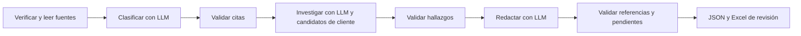

# Prueba técnica AQR

Primera versión implementada: lectura de los 275 expedientes, LangGraph con tres llamadas separadas, validación de evidencias, borradores, presupuesto compartido en JSON y Excel de revisión asistida.

**Estado:** validada localmente con pruebas automatizadas y los archivos reales. Todavía no ejecutada con OpenAI: falta configurar la clave. Las respuestas simuladas de las pruebas no son resultados reales ni métricas de calidad. Consumo de API del proyecto: USD 0.

## Uso inmediato en PowerShell

Desde la carpeta del proyecto, preparar los datos sin llamar al proveedor:

```powershell
.\.venv\Scripts\python.exe -m aqr prepare --scope development
```

Ejecutar los 20 casos. La terminal pide la clave de manera oculta y no la guarda:

```powershell
.\.venv\Scripts\python.exe -m aqr run --scope development --ask-key
```

También se puede usar OPENAI_API_KEY en el entorno y omitir --ask-key. No poner la clave en código, argumentos ni mensajes de chat. Para comprobar primero un caso, agregar --limit 1; después el comando completo reutiliza las etapas válidas.

El comando muestra la ruta runs/<ejecucion>.json. Sustituir <ejecucion> en los ejemplos por el nombre real:

```powershell
.\.venv\Scripts\python.exe -m aqr export --run runs/<ejecucion>.json --output outputs/Revision_asistida_20.xlsx
```

Después de revisar el Excel:

```powershell
.\.venv\Scripts\python.exe -m aqr import-review --run runs/<ejecucion>.json --workbook outputs/Revision_asistida_20.xlsx --output revision/etiquetas_desarrollo.json
```

El exportador y el importador se niegan a sobrescribir revisiones existentes. En **Revision**, elegir Aceptar o Corregir. Sin decisión explícita no hay etiqueta humana. Corregir requiere tipología, causalidad y evidencia/justificación. Investigación y carta se revisan por separado. Las anotaciones son desarrollo asistido, no evaluación independiente.

Consultar presupuesto o preparar todos los casos sin API:

```powershell
.\.venv\Scripts\python.exe -m aqr budget
.\.venv\Scripts\python.exe -m aqr prepare --scope all
```

La ejecución final usa run --scope all después de fijar el flujo y el protocolo de evaluación. Incluye también los 20 de desarrollo. El Excel inicial sin sugerencias se conserva; no hace falta completarlo.

## Flujo



Los candidatos de cliente se preparan en Python y llegan a investigación. Clasificación solo recibe fuentes del radicado. No hay agentes autónomos, navegación, herramientas bancarias ni envíos de cartas.

**Causalidad** se interpreta como motivo específico de la solicitud en texto, con citas. El enunciado no entrega catálogo de causalidades. El catálogo de nueve motivos propuesto anteriormente fue retirado. Una causa documentada del problema es un hallazgo distinto y puede no existir.

## Configuración inicial

config/openai.json: GPT-5.6 Luna, razonamiento none, topes de salida 1600/4000/2400 tokens, timeout 90 segundos y como máximo un reintento explícito ante errores transitorios. Son parámetros iniciales para medir con desarrollo, no una selección óptima demostrada. No se configura temperatura ni se promete determinismo del modelo.

Antes de generar se consulta el conteo de entrada. Se reserva su coste con margen de 1024 tokens, tarifa conservadora de entrada que contempla escritura de caché y salida máxima. Se bloquean entradas superiores a 200 000 tokens para evitar tarifa de contexto largo. Servicio estándar; sin herramientas facturables.

runs/budget.json conserva el consumo de todas las ejecuciones. **No borrarlo para reanudar.** Los importes son cotas conservadoras con tarifas verificadas el 15/09/2026, no facturas del proveedor. Una llamada incierta mantiene toda su reserva. Se rechazan límites superiores a USD 3. El control no limita otras aplicaciones ni cambios de tarifa del proveedor.

El SDK no reintenta automáticamente. El conteo no genera respuestas LLM; hay tres llamadas de generación por caso completo sin errores ni caché. El bloqueo impide dos ejecuciones simultáneas. JSON se escribe mediante sustitución atómica.

## Errores y reanudación

- Repetir el comando reutiliza etapas completas de la misma versión, fuentes y configuración.
- Los recibos recuperan respuestas recibidas sin repetir llamadas pagadas.
- Un error de credenciales, petición o presupuesto detiene el lote y conserva etapas anteriores; los demás casos quedan pendientes.
- Citas inexistentes, JSON inválido o referencias incompletas detienen ese caso. El resto puede continuar.
- Un resultado inválido no se regenera silenciosamente. Revisar el fallo; corregir prompts o implementación produce una nueva versión.
- Una llamada sin recibo no se repite al reanudar. Su reserva queda pendiente de revisión del consumo. No hay reconciliación automática.
- Una versión nueva invalida caché; el gasto sigue acumulándose en el mismo ledger.

## Reproducir el entorno

Python 3.12. Copiar proyecto, revision/desarrollo.json, INSUMOS.json y archivos fuente. No copiar .venv. Para continuar en otro equipo copiar también **todos** los JSON de runs y detener el proceso original; no ejecutar dos copias independientes del presupuesto.

```powershell
py -3.12 -m venv .venv
.\.venv\Scripts\python.exe -m pip install -r requirements.lock.txt
.\.venv\Scripts\python.exe -m pip check
.\.venv\Scripts\python.exe -m unittest discover -s tests -v
```

Si falta el manifiesto de desarrollo, reconstruirlo con scripts/preparar_revision.py. Los originales se verifican contra INSUMOS.json y no se modifican.

## Archivos principales

- aqr/schemas.py: contratos Pydantic.
- aqr/prompts.py: instrucciones de las tres etapas.
- aqr/data.py: fuentes, procedencia, cruces y conflictos.
- aqr/workflow.py: grafo y caché; aqr/validation.py: controles entre etapas.
- aqr/provider.py, budget.py, storage.py: API, consumo y persistencia.
- aqr/export.py, review.py: Excel y etiquetas humanas explícitas.
- tests/test_pipeline.py: pruebas sin consumo de API.

## Límites y pendientes

Las pruebas verifican integridad, flujo, presupuesto y fallos. No demuestran precisión de clasificación ni calidad de cartas. Una cita literal puede estar mal interpretada. Las cartas siempre son borradores.

Desarrollo contiene 20 clientes distintos; sus 27 radicados asociados quedan excluidos de la selección final. Faltan seleccionar los 30 casos representativos y 10 difíciles, separar notas similares, decidir rúbrica y umbrales, revisar desarrollo, comparar Ollama y ejecutar evaluación final. No se han usado resultados del modelo para seleccionar pruebas.

El protocolo de evaluación final y los cambios posteriores de arquitectura se consultarán con el usuario.

## Referencias

- [Structured Outputs](https://developers.openai.com/api/docs/guides/structured-outputs): JSON estricto, no garantía factual.
- [Conteo de tokens](https://developers.openai.com/api/docs/guides/token-counting): conteo previo de la petición.
- [GPT-5.6 Luna](https://developers.openai.com/api/docs/models/gpt-5.6-luna): modelo y tarifas; falta comprobar acceso.
- [LangGraph Graph API](https://docs.langchain.com/oss/python/langgraph/graph-api): nodos y transiciones.

